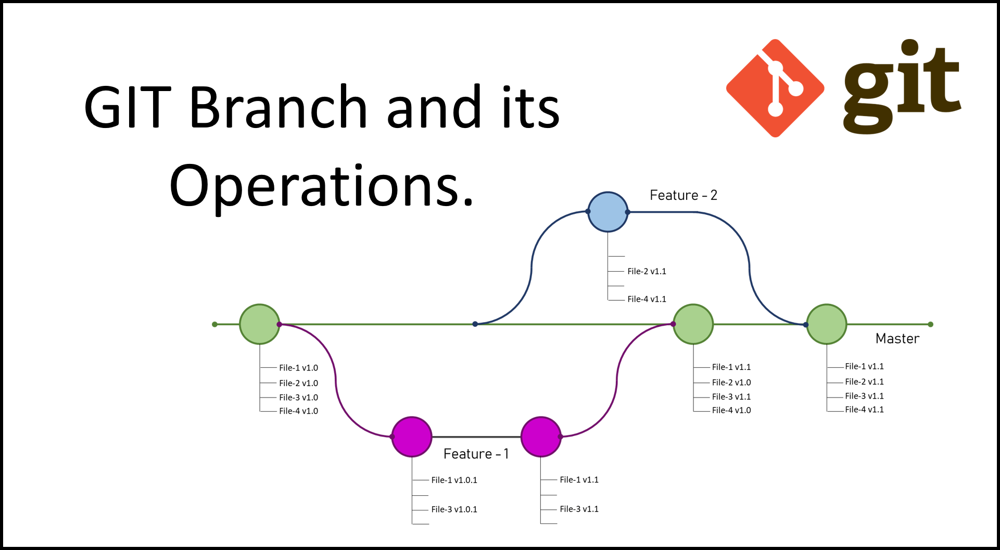

# GitUebung

Branches in der Softwareentwicklung sind separate Entwicklungslinien, die von der Hauptentwicklungslinie abzweigen.Sie ermöglichen es Entwicklern, parallel an verschiedenen Aspekten des Projekts zu arbeiten, ohne die Hauptentwicklung zu beeinträchtigen. Zum Beispiel können separate Branches für neue Funktionen, Fehlerbehebungen oder Experimente erstellt werden. Das Zusammenführen von Änderungen aus verschiedenen Branches erfolgt durch Merging, wobei gegebenenfalls Konflikte manuell gelöst werden müssen.

